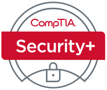
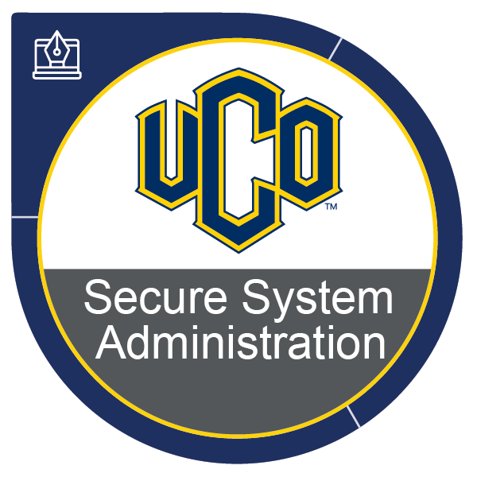

# Teaching

- <h4 id="SSA">CMSC4163/5163: Secure System Administration</h4>

 &nbsp; &nbsp; &nbsp; &nbsp; Fall2022; Fall2023; Fall2024; Fall2025

 &nbsp; &nbsp; &nbsp; &nbsp; This class covers materials for CompTIA Linux+ Certificate, and partially covers Security+ Certificate. 

&nbsp; &nbsp; &nbsp; &nbsp; 
 </img> 
 </img> 
 </img>

- <h4 id="OS">CMSC4153/5053: Operating Systems</h4>

 &nbsp; &nbsp; &nbsp; &nbsp; Spring&Fall 2022; Spring&Fall 2023; Spring&Fall 2024; Spring&Fall 2025

- <h4 id="DS">CMSC3613: Algorithms & Advanced Data Structures</h4>

 &nbsp; &nbsp; &nbsp; &nbsp; Spring 2023; Spring 2024; Spring 2025

- <h4 id="P1">CMSC1613: Programming I</h4>

 &nbsp; &nbsp; &nbsp; &nbsp; Spring 2022; Fall 2022; Spring 2023; Summer 2025

- <h4 id="SDD">CMSC4513/SE4513: Software Design & Development</h4>

 &nbsp; &nbsp; &nbsp; &nbsp; Spring 2022

